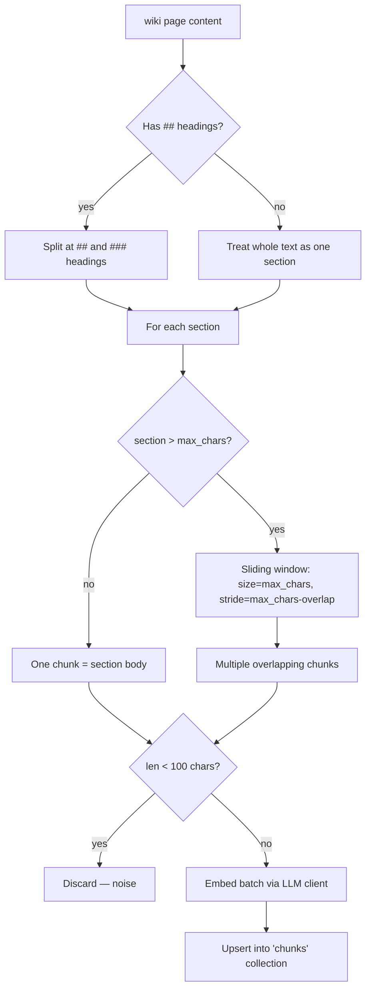

# LW-20.1 — Chunk-level Retrieval for AnswerAgent

## Why two collections?

The system maintains two ChromaDB collections with a strict separation of concerns:

| Collection | Granularity | Consumer | Task |
|---|---|---|---|
| `headings` | One embedding per page *title* | `SearchAgent`, `IndexStorage` | "Which existing wiki pages should be updated when a new document is ingested?" — a page-level classification. |
| `chunks` | One embedding per ~500-token *body fragment* | `AnswerAgent` | "Which paragraph of the wiki actually answers the user's question?" — a passage-level extraction. |

Merging them into a single collection would degrade both tasks:
- The `SearchAgent` would start receiving chunk IDs (`wiki-page#0003`) instead of page slugs.
- Title embeddings and body-chunk embeddings produce incomparable similarity scores (different text
  length and semantics), so thresholds tuned for one task break the other.

## How chunking works



Default settings (configurable via `.env`):

| Setting | Default | Meaning |
|---|---|---|
| `CHUNK_MAX_CHARS` | 2000 | ~500 tokens per chunk |
| `CHUNK_OVERLAP_CHARS` | 200 | Overlap to avoid answer truncated at boundary |
| `CHUNK_RETRIEVAL_TOP_K` | 8 | Chunks retrieved per query |

## How to reindex

**On first deploy** (existing wiki pages were written before LW-20.1):
```bash
docker compose exec api uv run python scripts/reindex_chunks.py
```

**Dry run** (preview chunk count without writing to Chroma or calling the API):
```bash
docker compose exec api uv run python scripts/reindex_chunks.py --dry-run
```

**After a model change** (`EMBEDDING_MODEL` or `EMBEDDING_DIMENSIONS`):
```bash
# Run both scripts — both collections must use the same model
docker compose exec api uv run python scripts/reindex.py
docker compose exec api uv run python scripts/reindex_chunks.py
```

The ingestion pipeline (`pipeline.py`) calls `sync_chunks_for_page()` automatically after each
`_save_wiki_page()`, so routine ingestion keeps the chunk index up to date without manual
intervention.

## Regression test fixture

`tests/fixtures/sample_wikis/training-with-adam.md` is a page titled "Training" whose body
mentions the Adam optimizer.  A heading-only index would score this page low for the query
*"what optimizer do we use?"* (because the title "Training" is semantically distant from
"Adam optimizer").  The chunk index correctly surfaces the `## Optimizers` section.
